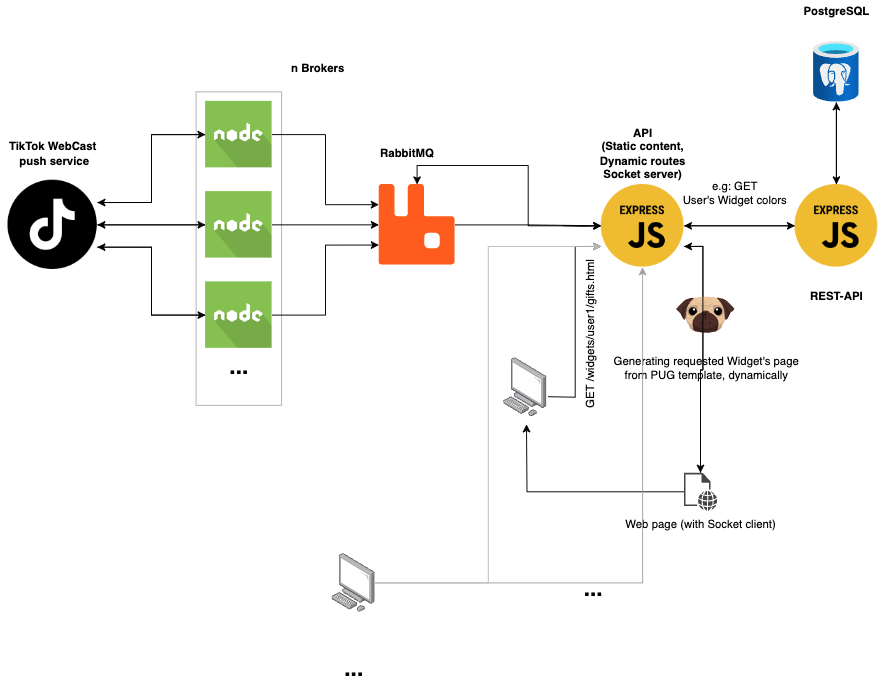

StreamShape: A TikTok Live Streaming SaaS Showcase
==================================================

Welcome to the source code of [StreamShape](https://streamshape.net/), one of my initial endeavors in building a SaaS platform. Although this project has been discontinued and might be outdated, I am sharing it for anyone interested in learning from or continuing the project.

Overview
--------

StreamShape was created in about two months while I was studying and working on it during nights and weekends. The project leverages the [TikTok Live Connector](https://github.com/zerodytrash/TikTok-Live-Connector) and aims to provide a scalable solution for streamers. However, due to constant changes in TikTok's security, the service faced disruptions, leading to its discontinuation.

Despite some missing features and areas for improvement, such as unit tests and abstract layers, StreamShape managed to attract a dozen customers with monthly subscriptions within three months.

End User Product
--------
Here is an example of the product being used in a real-life scenario by the TikTok Streamer [Elric](https://www.tiktok.com/@elric.off) : 

*  [Real Time Chat Widget](https://www.youtube.com/watch?v=70_usy6__E0) \
\

* [Alert Widgets](https://www.youtube.com/watch?v=F-k9EPhZYfA) \
\

Architecture
------------

The ideal architecture for this project consisted of:

*   Microk8s instances or AWS Lambdas executing each user's TikTok brokers (listening to the user's TikTok stream events)
*   A managed PostgreSQL database with automatic scaling, replication, and backups (AWS RDS)
*   A managed headless Node.js server generating dynamic widgets and listening to broker events (AWS Elastic Beanstalk)
*   A managed RabbitMQ server (AWS MQ)

However, due to my limited experience with AWS at the time, I used DigitalOcean instances for all components and manually deployed brokers for new subscribers. The project could be migrated to a more sophisticated architecture as described above if needed.

StreamShape also utilized external SaaS solutions, such as Better Uptime for monitoring APIs and brokers and Stripe for handling subscriptions.

Modules Breakdown
-----------------

1.  **TikTok Broker**: One "Broker" per TikTok user runs in a small container. The broker listens to the user's events from TikTok's internal WebCast push service and emits them to the RabbitMQ server on the user's respective channel.
2.  **Server**: The "Server" folder contains an Express.js server handling sockets, static content, and dynamic routes. This server consumes all MQTT events sent by brokers and handles them by transmitting them to the user's dedicated widget page.
3.  **Dynamic Widget Page**: Each user has a unique route generated by their database ID. The server searches for the associated TikTok username with this StreamShape user ID, e.g., `https://widgets.streamshape.com/5600e838-26e8-4a61-a0a1-3d1d917efb35/gifts`. The server dynamically generates an HTML/CSS/JS page (using Pug templating) with a socket that listens to the emitted events. When a TikTok user receives an event, a JS function on this dynamic page executes the desired behavior (animations, text on screen, etc.).
4.  **User Configuration**: The dynamic page is generated from the StreamShape user's config database table. When navigating to the user's widget page, the server queries the REST API, retrieves the user ID in the URL, and fetches the user's configuration, such as custom colors and alerts.

Future Plans
------------

I had initially planned to create a user dashboard and automate broker creation when a new user subscribes to the service. The dashboard would have allowed streamers to manage their subscriptions, customize their widgets with a user-friendly interface, and more.

Conclusion
----------

Thanks to StreamShape, I have developed valuable skills in building a functional SaaS product from scratch, while focusing on the eXtremeLean philosophy of rapidly delivering a Minimum Viable Product (MVP). This project has not only honed my technical expertise but also provided me with insights into the challenges of creating a successful SaaS platform. I invite you to explore the project, learn from it, or continue developing it further.

Acknowledgments
----------
Special thanks to :
*  [François-Guillaume RIBREAU](https://github.com/FGRibreau) for sharing his knowledge and experience with me on SaaS projects.
*  [William PIERRE](https://www.linkedin.com/in/william-pierre-879020153/) for his outstanding work in managing and acquiring new clients, and for his contributions to the business side of the project.

Contact me on [Twitter](https://twitter.com/zayed_charef) or email me at zayed.charef@gmail.com if you have any questions.